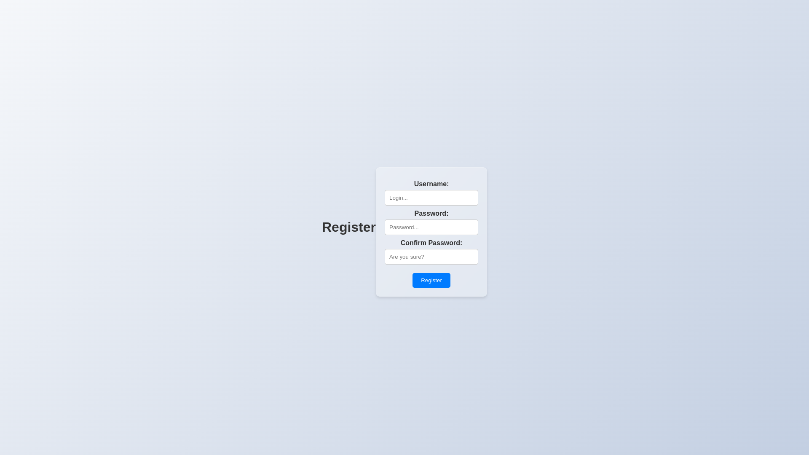

# Chat Application

Welcome to the Chat Application! This is a prototype chat application built with Flask and Flask SocketIO It demonstrates basic chat functionality, including user login, registration, and real-time messaging.

## Features

- User authentication (login and registration)
- Real-time messaging using Flask SocketIO
- Animated UI elements

## Technologies Used

- Python
- Flask
- Flask SocketIO
- HTML/CSS
- JavaScript

### Prerequisites

- Python 3.x
- pip (Python package installer)

## Contributors

- **[fekijj](https://github.com/fekijj)**
- **[OSGOTTVINE](https://github.com/OSGOTTVINE)**

## Screenshots

Here are some screenshots of the application:

### Welcome Page


### Login Page


### Register Page


### Chat Room


### Setup

1. **Clone the repository**

   ```bash
   git clone https://github.com/fekijj/online-chat-study-project.git -b recode
   cd online-chat-study-project

2. **Create a virtual environment**

    ```bash
    python -m venv venv

3. **Activate the virtual environment**

    On windows :

        ```bash
        venv\Scripts\activate

    On macOS and Linux :
    
        ```bash
        source venv/bin/activate

4. **Install requirements**

    ```bash
    pip install -r requirements.txt

5. **Run the application**

    ```bash
    python app.py
